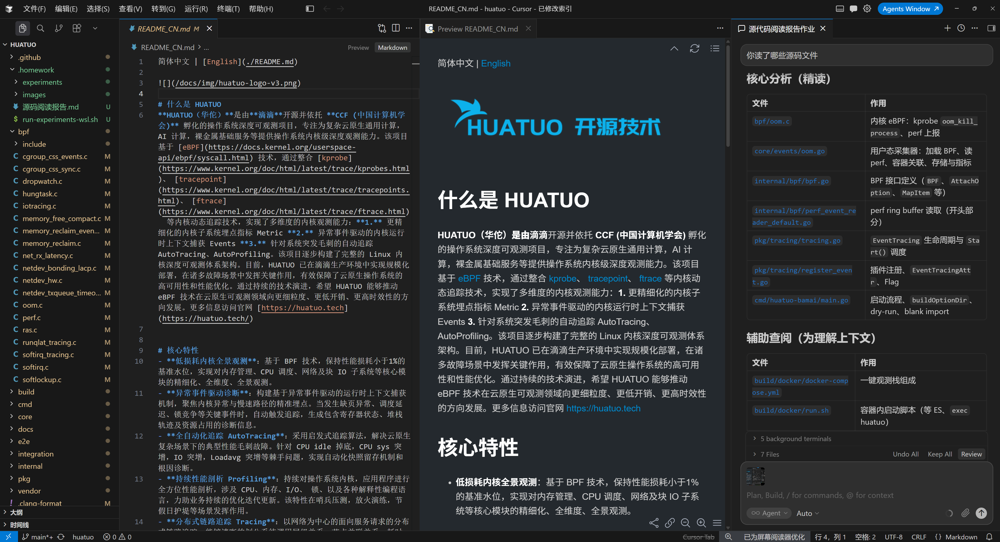
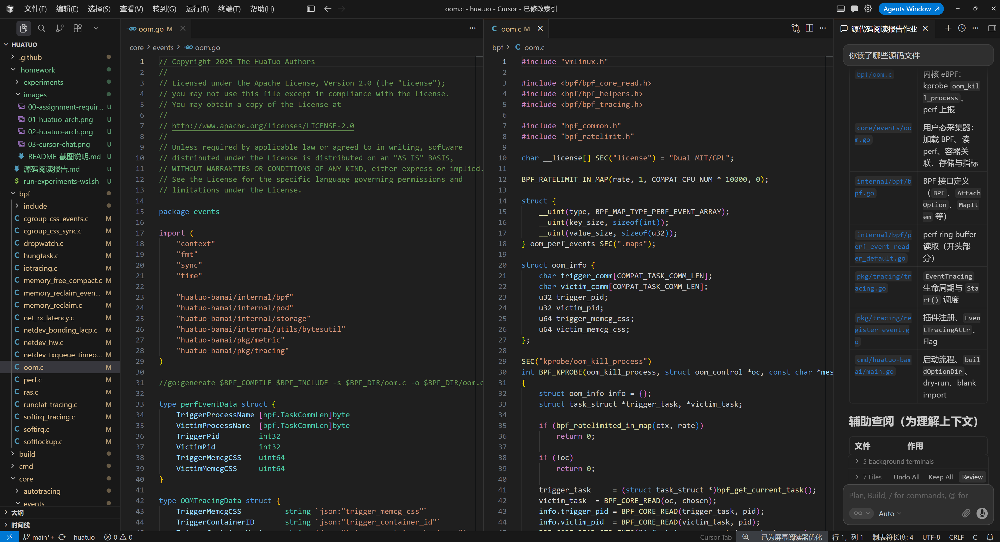
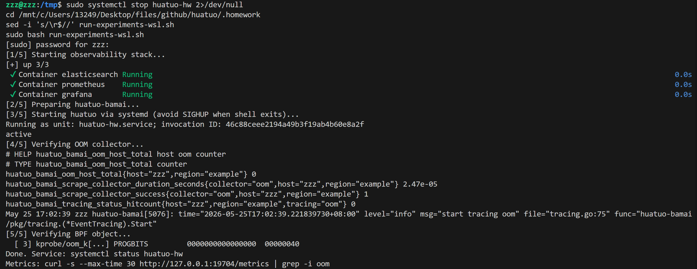
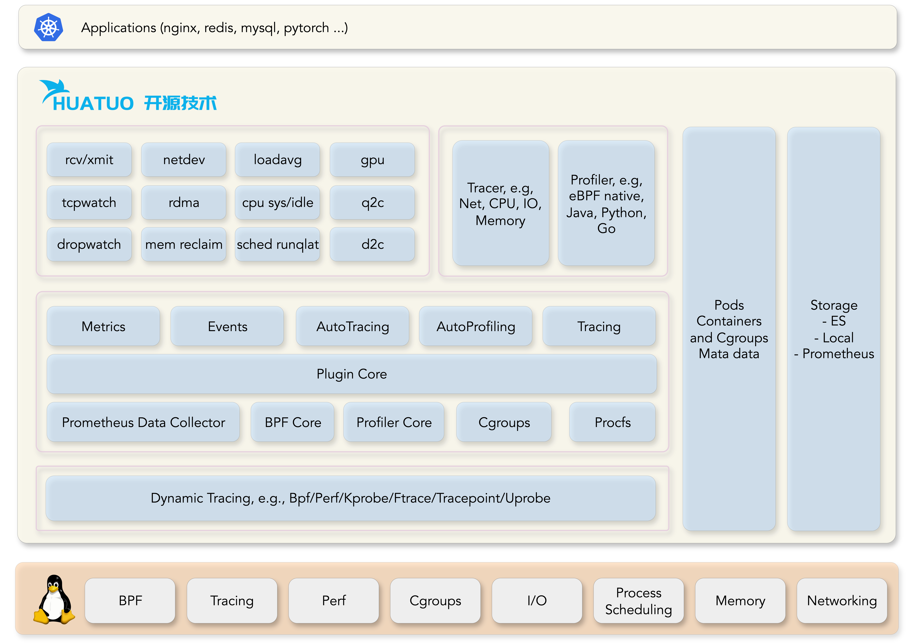
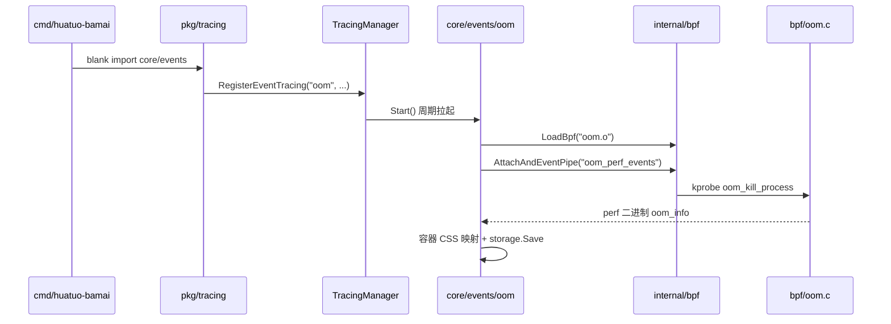
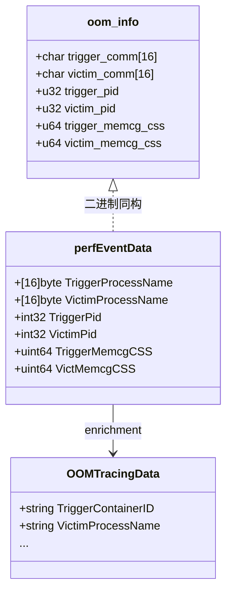
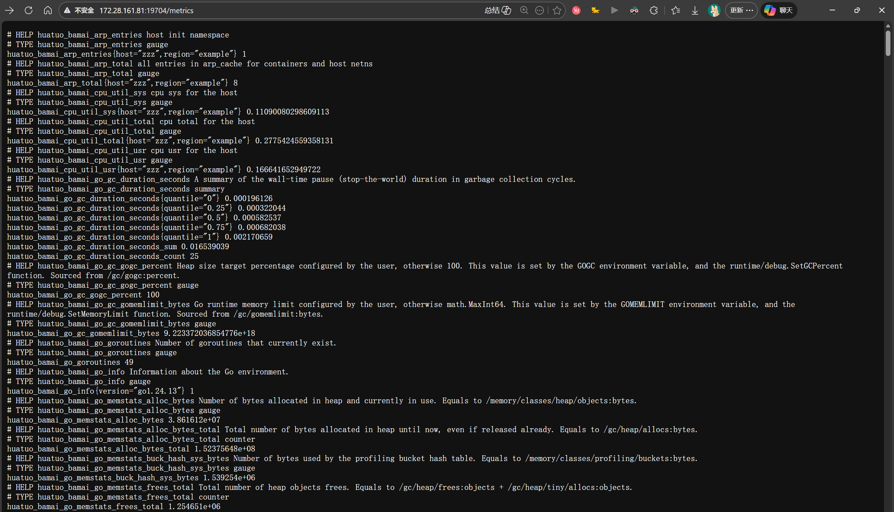
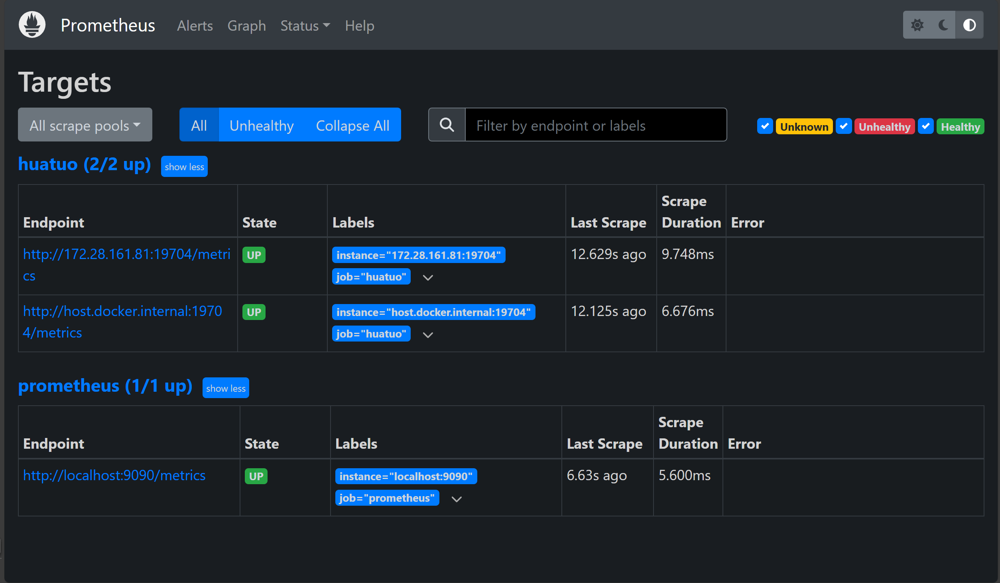
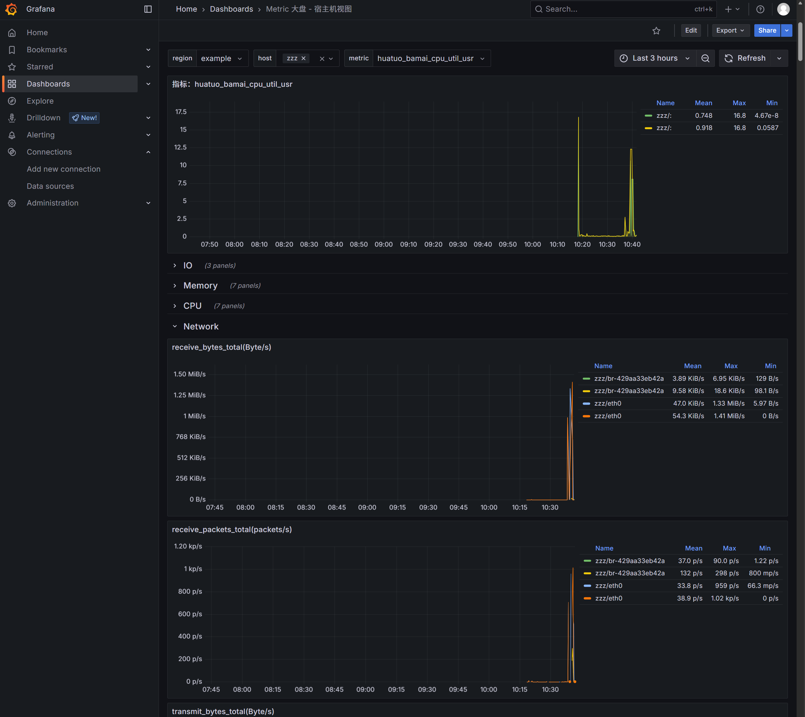

# 源码阅读与分析报告

**课题**：基于实践项目 HUATUO（华佗）的 AI 辅助源码阅读  
**分析对象**：OOM（内存耗尽）事件采集链路 — `bpf/oom.c` + `core/events/oom.go`  

本报告依次完成：AI 工具说明与使用过程、HUATUO 项目概述、OOM 采集原理与数据结构分析，并在 WSL 环境中通过指标接口与 Prometheus/Grafana 观测栈验证采集器运行正常，最后总结问题与收获。

---

## 一、工具说明

| 项目 | 内容 |
|------|------|
| **工具名称** | Cursor IDE（内置 AI 编程助手 Composer） |
| **版本** | Cursor 2.x（Agent 模式，模型 Composer 2.5 Fast） |
| **使用方式** | 在仓库中打开 HUATUO 项目，通过自然语言提问驱动 AI 检索、解释、跨文件跳转；结合终端在 `wsl -d Ubuntu` 中运行实验命令 |

### 使用过程

1. **提问与导读**：向 AI 询问「OOM 采集器如何工作」「`oom_perf_events` 与 Go 结构体如何对应」等，由 AI 在仓库内定位 `bpf/oom.c`、`core/events/oom.go` 及 `internal/bpf`、`pkg/tracing` 等相关文件并给出调用链说明。
2. **对照阅读**：在 Cursor 中分屏打开内核态与用户态源码，核对 `struct oom_info` 与 `perfEventData` 字段是否一一对应。
3. **实验验证**：在 WSL Ubuntu 中用 `systemd-run` 启动 `huatuo-bamai`，检查日志 `start tracing oom`、`:19704/metrics` 中的 OOM 指标，并配合 Docker 观测栈查看 Prometheus/Grafana。



*图 1：通过 Cursor AI 提问并梳理 OOM 采集链路*



*图 2：分屏阅读 `bpf/oom.c` 与 `core/events/oom.go`*



*图 3：WSL 终端中验证 huatuo 进程、OOM 指标与 BPF 对象*

---

## 二、项目概述

### 2.1 项目背景

**HUATUO（华佗）** 是滴滴开源、依托 CCF 孵化的 **Linux 内核深度可观测** 项目。基于 **eBPF**，整合 kprobe、tracepoint、ftrace 等技术，为云原生与 AI 计算场景提供：

- **Metrics**：细粒度内核/容器指标（Prometheus）
- **Events**：异常事件驱动上下文捕获（如 OOM、软锁死）
- **AutoTracing**：启发式自动追踪性能毛刺

项目已在生产环境规模化部署，官网：https://huatuo.tech

### 2.2 编程语言与技术栈

| 语言/技术 | 用途 |
|-----------|------|
| **Go 1.24** | 主守护进程 `huatuo-bamai`、BPF 加载、HTTP API、存储 |
| **C** | 内核态 eBPF 程序（CO-RE + BTF） |
| **Shell** | 构建、Docker Compose、集成测试 |
| **Prometheus / Grafana / Elasticsearch** | 指标与事件存储展示 |

### 2.3 代码结构与特点

```
huatuo/
├── cmd/huatuo-bamai/     # 主程序入口，blank import 注册插件
├── core/
│   ├── events/           # 内核事件采集（含 oom.go）
│   ├── metrics/          # Prometheus 指标
│   └── autotracing/      # 自动追踪
├── bpf/                  # eBPF C 源码及编译产物 .o
├── internal/bpf/         # cilium/ebpf 加载、perf 读取
├── pkg/tracing/          # 插件注册与 TracingManager
└── build/docker/         # 一键观测栈
```

**架构特点**：

1. **插件化**：各采集器在 `init()` 中调用 `tracing.RegisterEventTracing` 注册，主程序仅 blank import。
2. **统一流水线**：BPF 加载 → attach → perf event 读 → 容器元数据 enrichment → 存储/指标。
3. **内核/用户态结构体对齐**：Go 侧 `perfEventData` 必须与 `bpf/oom.c` 中 `struct oom_info` 字节布局一致。



*图 4：HUATUO 分层架构（应用层 → 插件核心 → 动态追踪 → Linux 内核）*

---

## 三、原理分析

### 3.1 所选代码的功能

本报告聚焦 **OOM（Out Of Memory）事件采集器**，当内核 `oom_kill_process` 选中牺牲进程时：

1. **内核态**（`bpf/oom.c`）：kprobe 读取触发者/受害者进程名、PID、memory cgroup CSS，经 perf event 数组上报。
2. **用户态**（`core/events/oom.go`）：读取 perf 数据，关联容器 ID/hostname，写入存储，并更新 Prometheus 计数器。

### 3.2 在整体项目中的位置



| 层次 | 文件 | 职责 |
|------|------|------|
| 入口 | `cmd/huatuo-bamai/main.go` | 初始化 BPF、TracingManager、HTTP `:19704` |
| 注册 | `pkg/tracing/register_event.go` | 工厂注册表 `factories["oom"]` |
| 调度 | `pkg/tracing/tracing.go` | `EventTracing.Start()`  goroutine + 重启间隔 |
| 业务 | `core/events/oom.go` | OOM 特有逻辑与指标 |
| 内核 | `bpf/oom.c` | eBPF kprobe + perf 输出 |

### 3.3 与其他模块的关系

- **`internal/bpf`**：所有事件采集器共用的 `LoadBpf`、`AttachAndEventPipe`、`ReadInto`。
- **`internal/pod`**：通过 memcg CSS 将 cgroup 映射为 `container_id` / `hostname`。
- **`internal/storage`**：事件 JSON 写入 ES 或本地文件（本实验使用 `--disable-storage` 仅验证指标）。
- **`pkg/metric`**：OOM 同时带 `FlagTracing | FlagMetric`，暴露 `huatuo_bamai_oom_host_total` 等。

### 3.4 关键代码片段

**内核 kprobe**（`bpf/oom.c`）：

```c
SEC("kprobe/oom_kill_process")
int BPF_KPROBE(oom_kill_process, struct oom_control *oc, const char *message)
{
    // 限流 → 读取 trigger/victim task → bpf_perf_event_output
}
```

**用户态主循环**（`core/events/oom.go`）：

```go
reader, err := b.AttachAndEventPipe(childCtx, "oom_perf_events", 8192)
for {
    var data perfEventData
    reader.ReadInto(&data)
    // BuildCssContainersID → OOMTracingData → storage.Save("oom", ...)
}
```

---

## 四、数据结构

### 4.1 内核态 `struct oom_info`（`bpf/oom.c`）

| 字段 | 类型 | 含义 |
|------|------|------|
| `trigger_comm` | `char[16]` | 触发 OOM 的进程名 |
| `victim_comm` | `char[16]` | 被选中杀死的进程名 |
| `trigger_pid` / `victim_pid` | `u32` | PID |
| `trigger_memcg_css` / `victim_memcg_css` | `u64` | memory cgroup 子系统 CSS 指针 |

**BPF Map**：`oom_perf_events`（`BPF_MAP_TYPE_PERF_EVENT_ARRAY`）用于向用户态 perf ring buffer 送事件。

### 4.2 用户态原始事件 `perfEventData`（`core/events/oom.go`）

与 `oom_info` **字段顺序、大小完全一致**（`TaskCommLen=16`），供 `ReadInto` 二进制解码。

### 4.3  enriched 存储结构 `OOMTracingData`

在原始数据上增加 JSON 字段：`trigger_container_id`、`victim_container_hostname` 等，供 Elasticsearch 检索。

### 4.4 框架结构

| 结构体 | 包 | 作用 |
|--------|-----|------|
| `EventTracingAttr` | `pkg/tracing` | 插件工厂返回：间隔、Flag、`TracingData` |
| `EventTracing` | `pkg/tracing` | 运行时包装，管理 goroutine 生命周期 |
| `ITracingEvent` | `pkg/tracing` | 接口：`Start(ctx) error` |
| `BPF` / `PerfEventReader` | `internal/bpf` | 加载、attach、perf 读 |

### 4.5 结构关系图



---

## 五、问题/特性分析与反思

### 5.1 特性分析

1. **限流**：`BPF_RATELIMIT_IN_MAP` 防止 OOM 风暴时 perf 缓冲区被打满。
2. **双端计数**：受害者若在容器内则 `outOfMemoryCounterContainer` 递增，否则 `outOfMemoryCounterHost`。
3. **CO-RE**：`BPF_CORE_READ` 适配多内核版本 BTF。

### 5.2 实验部分

#### 实验环境

| 项 | 配置 |
|----|------|
| 操作系统 | Windows 11 + **WSL2 Ubuntu**（`wsl -d Ubuntu`） |
| 内核 | `6.6.87.2-microsoft-standard-WSL2` |
| Docker | Docker Desktop，Integration 启用 Ubuntu |
| HUATUO 镜像 | `huatuo/huatuo-bamai:latest`（v2.2.0） |
| 运行方式 | **在 WSL 主机以 root 直接运行**（非 compose 内 huatuo 容器，见 5.3） |

> **说明**：`docker compose` 中 `huatuo-bamai` 服务将宿主机 `/run` 整目录挂载进容器，会导致 `os.Executable()` 失败（`panic: find running dir`）；在 WSL 本机运行可正常使用 systemd cgroup。

#### 实验一：结构体布局验证

**目的**：用户态 `ReadInto` 按二进制直接解码 perf 事件，要求 Go 结构体与内核 `struct oom_info` 字段顺序、对齐后总大小一致。

**内核侧定义**（`bpf/oom.c`）：

```c
struct oom_info {
    char trigger_comm[COMPAT_TASK_COMM_LEN];  // 16
    char victim_comm[COMPAT_TASK_COMM_LEN];   // 16
    u32 trigger_pid;
    u32 victim_pid;
    u64 trigger_memcg_css;
    u64 victim_memcg_css;
};
```

**用户态对应结构**（`core/events/oom.go`）：

```go
type perfEventData struct {
    TriggerProcessName [bpf.TaskCommLen]byte  // 16
    VictimProcessName  [bpf.TaskCommLen]byte  // 16
    TriggerPid         int32
    VictimPid          int32
    TriggerMemcgCSS    uint64
    VictimMemcgCSS     uint64
}
```

**验证脚本**（`.homework/experiments/verify_oom_struct.go`）用 `unsafe.Sizeof` 计算 Go 侧大小并与 `16+16+4+4+8+8` 对比：

```go
s := unsafe.Sizeof(perfEventData{})
if s == 56 {
    fmt.Println("RESULT: PASS - layout size matches kernel struct oom_info")
}
```

**命令**：`go run .homework/experiments/verify_oom_struct.go`

**实测输出**（`experiments/verify_oom_struct_result.txt`）：

```
perfEventData size = 56 bytes
expected (oom_info in bpf/oom.c) = 16+16+4+4+8+8 = 56 bytes
RESULT: PASS - layout size matches kernel struct oom_info
```

结论：布局验证通过，perf 环形缓冲区中的原始字节可被 `reader.ReadInto(&data)` 正确解析。

#### 实验二：BPF 对象与 kprobe 段

**目的**：确认 `oom.o` 已编译并包含挂到 `oom_kill_process` 的 kprobe 程序段。

**内核程序要点**（`bpf/oom.c`）：

```c
struct {
    __uint(type, BPF_MAP_TYPE_PERF_EVENT_ARRAY);
} oom_perf_events SEC(".maps");

SEC("kprobe/oom_kill_process")
int BPF_KPROBE(oom_kill_process, struct oom_control *oc, const char *message)
{
    // 限流 → 读 trigger/victim task → bpf_perf_event_output(..., &info, sizeof(info))
}
```

**命令**：`readelf -S /tmp/huatuo-bamai/bpf/oom.o | grep -i oom`

**实测输出**（`experiments/oom-bpf-sections.txt`）：

```
  [ 3] kprobe/oom_k[...] PROGBITS         0000000000000000  00000040
       00000000000004d0  0000000000000000  AX       0     0     8
```

结论：ELF 中存在 `kprobe/oom_kill_process` 段，说明 BPF 对象已正确编译，可被 `bpf.LoadBpf` 加载并 attach。

#### 实验三：启动 HUATUO 并验证 OOM 采集器

**目的**：在 WSL 主机运行 `huatuo-bamai`，确认 OOM tracer 已注册、BPF 已 attach、Prometheus 指标可抓取。

**启动方式**（`run-experiments-wsl.sh` 核心逻辑）：

```bash
systemd-run --unit=huatuo-hw --property=KillMode=process \
  /tmp/huatuo-bamai/bin/huatuo-bamai \
  --region example --config-dir /tmp/huatuo-bamai/conf \
  --bpf-dir /tmp/huatuo-bamai/bpf --disable-storage
```

**用户态采集主循环**（`core/events/oom.go` 伪代码）：

```go
reader, _ := b.AttachAndEventPipe(ctx, "oom_perf_events", 8192)
for {
    var data perfEventData
    reader.ReadInto(&data)
    // BuildCssContainersID → OOMTracingData → storage.Save("oom", ...)
    // 受害者不在容器内则 outOfMemoryCounterHost++
}
```

**插件注册**（同文件 `init`）：

```go
tracing.RegisterEventTracing("oom", newOOMCollector)
// Flag: tracing.FlagTracing | tracing.FlagMetric
```

**日志摘录**（`experiments/huatuo-oom-log.txt`）：

```
May 25 15:52:48 zzz huatuo-bamai[4771]: level="info" msg="start tracing oom"
```

**OOM 相关指标**（`experiments/metrics-oom.txt`，`curl http://127.0.0.1:19704/metrics | grep -i oom`）：

```
# HELP huatuo_bamai_oom_host_total host oom counter
# TYPE huatuo_bamai_oom_host_total counter
huatuo_bamai_oom_host_total{host="zzz",region="example"} 0
huatuo_bamai_scrape_collector_duration_seconds{collector="oom",host="zzz",region="example"} 2.9473e-05
huatuo_bamai_scrape_collector_success{collector="oom",host="zzz",region="example"} 1
huatuo_bamai_tracing_status_hitcount{host="zzz",region="example",tracing="oom"} 0
```

说明：`oom_host_total` 与 `tracing_status_hitcount` 为 0 表示实验期间未发生真实 OOM；`scrape_collector_success=1` 表示 OOM 指标采集器已成功注册并对外暴露。



*图 5：浏览器访问 `http://<WSL_IP>:19704/metrics`，可检索 `huatuo_bamai_oom_host_total` 等 OOM 指标*

#### 实验四：观测栈组件与可视化

- **步骤**：`docker compose -f build/docker/docker-compose.yml -f .homework/docker-compose.wsl-ports.yml up -d`；修复 Prometheus 抓取 WSL 主机 `19704`（`.homework/fix-grafana-data.sh`）；Grafana 数据源改为 `http://prometheus:9090`（WSL 端口映射场景）。
- **结果**：Elasticsearch / Prometheus / Grafana 容器 Running；Prometheus Targets 中 `huatuo` job 为 **UP**；Grafana「Metric 大盘 - 宿主机视图」在 `region=example`、`host=zzz` 下可见 CPU/网络等指标曲线。
**观测栈状态**（`experiments/docker-ps.txt`）：

```
NAMES           STATUS
elasticsearch   Up
grafana         Up
prometheus      Up
huatuo-bamai    在 WSL Ubuntu 主机上以 root 直接运行（非 compose 容器）
```



*图 6：`huatuo` 与 `prometheus` 两个 job 均为 UP；`172.28.161.81:19704` 为 WSL 主机上的 huatuo-bamai 指标端点*



*图 7：Grafana「Metric 大盘 - 宿主机视图」，`region=example`、`host=zzz`，可见 CPU 与网络等指标曲线*

### 5.3 问题与反思

| 问题 | 原因 | 处理 |
|------|------|------|
| compose 内 `huatuo-bamai` 退出 | 挂载 `/run` 破坏容器内 `/proc/self/exe` | 改在 WSL 主机运行 |
| Windows 容器无 systemd | `/run/systemd/private` 不存在 | 使用 `wsl -d Ubuntu` 的 systemd |
| WSL 暂无法触发真实 OOM | 实验环境未加压内存 | 指标为 0 属正常，采集器已成功注册 |

**收获**：通过「内核 BPF → perf → Go 解码 → 容器关联 → 指标」一条链，理解了可观测系统中 **跨语言结构体对齐** 与 **插件化注册** 的重要性；AI 工具适合快速建立全局图景，但实验验证仍需在 **真实 Linux + WSL** 环境中完成。